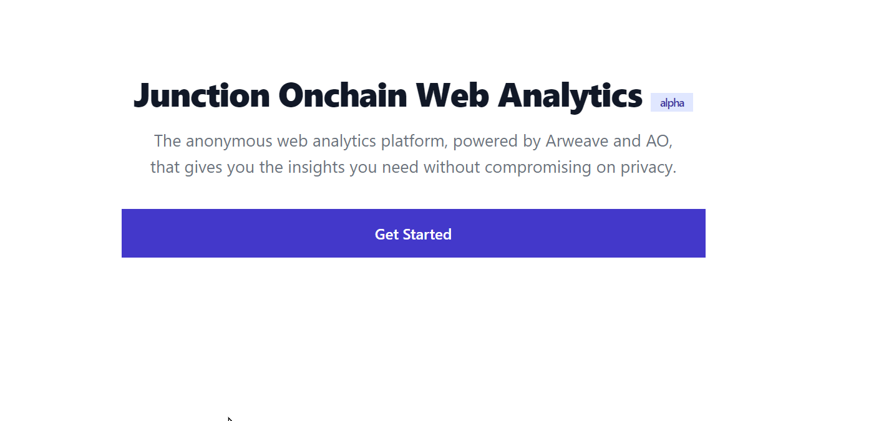
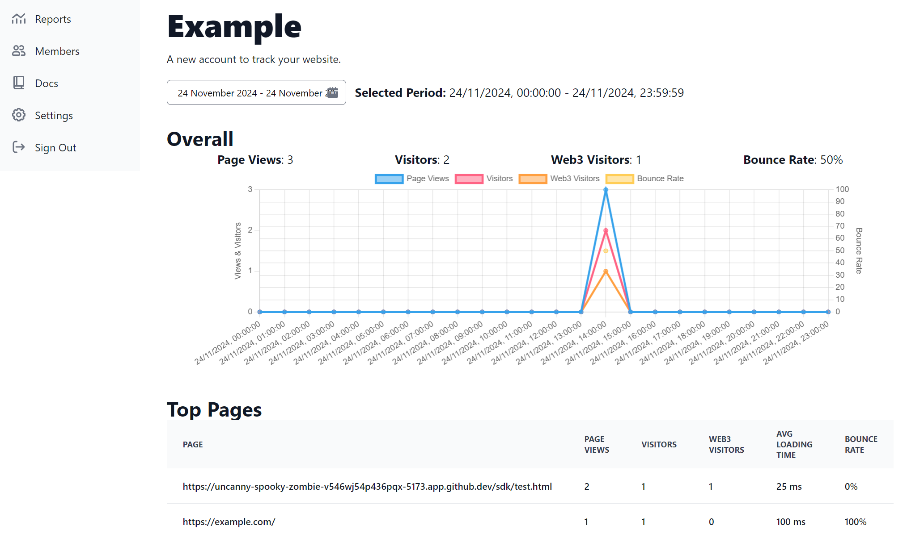
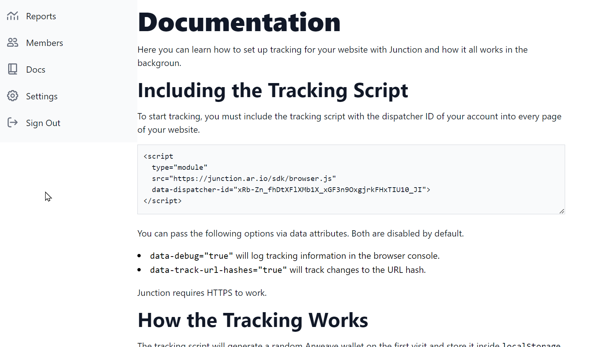
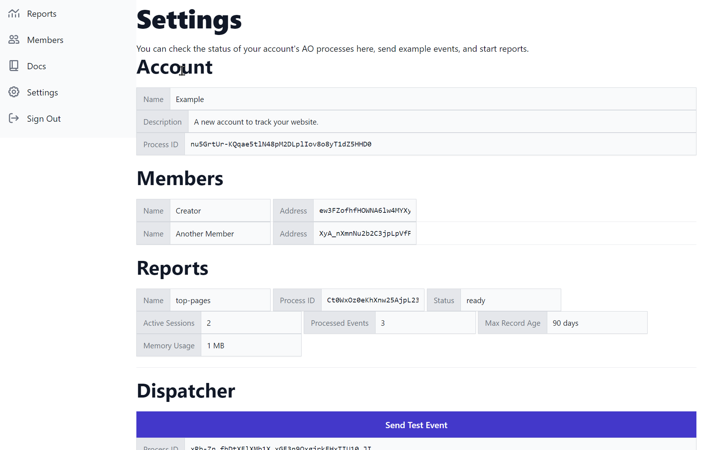

# JUNCTION

Junction is an anonymous onchain web analytics platform powered by Arweave and AO.

<https://junction.ar.io>

## Features

- **Decentralized**: The frontend is hosted on the Arweave blockchain. The backend is hosted on the AO network.
- **Anonymous**: Junction is an anonymous web analytics platform that respects user privacy by using randomly generated IDs and aggregating data.
- **Onchain**: Junction stores all data on the Arweave blockchain, ensuring that data is immutable and secure.

## Screenshots

### Landing Page

### Reports Dashboard

### Team Member Management

### Documentation

### Settings

## History

This was a decentralize LinkTree clone with web analytics features.

It was a submission to the Permahacks 2024 hackathon, where it won a finalist prize of $1000.

It was reworked to a more general web analyitcs tool and [submitted to the Fullstack Hack 2024 hackathon](https://devpost.com/software/junction-03qwj7).
